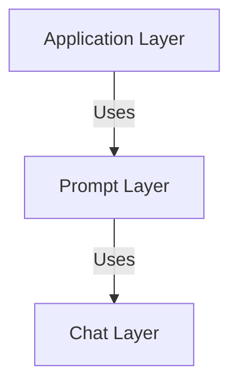
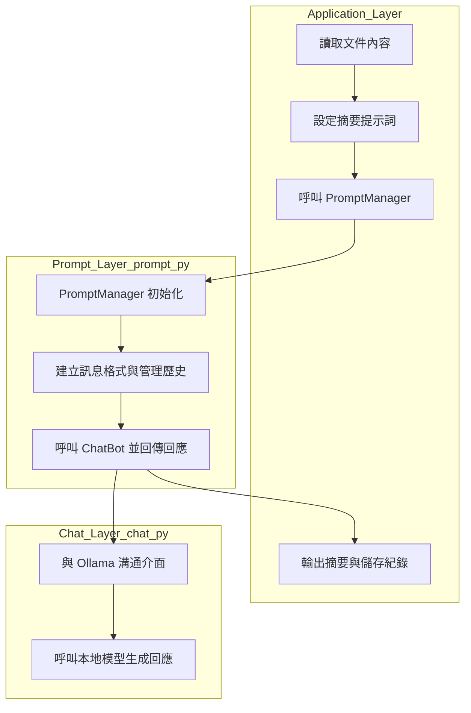

### 20250415 工作日誌｜文件摘要系統建構進度

✅ 今日進度總結

今天正式開始搭建 chat.py 之上的應用邏輯與 Prompt 工具層。完成了三個主要模組的撰寫與整合：
	1.	prompt.py：建立 PromptManager 類別，包裝了 chat 的多輪對話邏輯，能自動管理 conversation_id、歷史紀錄與 system prompt。
	2.	prompt_test.py：簡單測試 PromptManager 的 chat 功能，包含系統提示詞與多輪訊息歷史測試。
	3.	auto_summarize.py：建置完整的文檔摘要流程，實作輸入文檔、呼叫摘要模型、輸出摘要結果與清除歷史的自動化腳本。

⸻

🧱 專案分層結構圖

⸻

💡 說明與心得
	•	PromptManager 是今天的核心改進，將原本只能單輪的 chat.py 擴展成支援多輪、可重複呼叫的模組。
	•	system_prompt 現在可以靈活切換，未來可擴展不同的任務場景（摘要、分類、情感分析、QA）。
	•	auto_summarize.py 示範了全流程實作，也儲存了 json 輸出與對話歷史，方便後續追蹤。
	•	下一步預計擴展成支援 chunk 化輸入（token 限制）。
